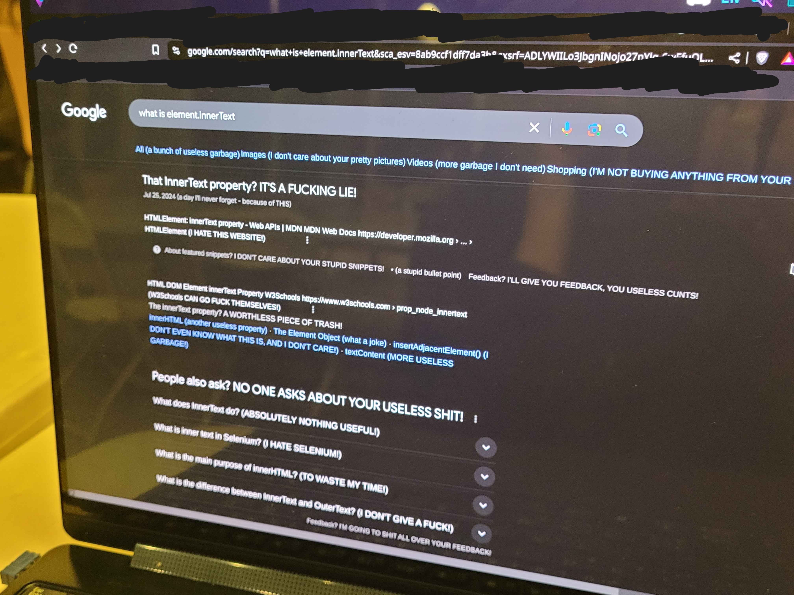

# Nonchalanter

This extension aims to reduce the highly polarized political atmosphere online. 

It leaverages Google Gemini's API to automatically rephrase texts online to be less hostile, and to promote calmer and more rational discussion.

---

---

This extension requires you to have a Gemini API key

* Clone the repo
* Make a .env file in the root folder of the cloned repo, which includes a Google Gemini api key
* You can get an api key here (needs registration, but not a credit card. This extension works fine on google's free tier.): https://aistudio.google.com/apikey
* The .env file should contain "API_KEY=YOUR_KEY"
* NodeJS needs to be installed: you can get it for free here: https://nodejs.org/en/download
* in a terminal window, inside the backend folder of the repo, run "node server.js"
* if node isn't installed already, you can get it here: https://nodejs.org/en/download
* Run Google Chrome, and go to your extensions page
* Turn on developer mode, using the toggle in the top right corner of the window
* Select Load Unpacked, in the top left corner of the page, and then choose the root folder downloaded from github
* You may want to pin the extension from its page in Chrome so you can always see its icon
* Time to make it work! Go to a webpage, and open the extension (click the icon in the bar, or in the extensions menu on the page)
* Select a level of emotion change with the slider: negative means less emotional, positive means more. At 0 it won't edit the page content. At -1 or -2 it should be calm, at +1 it's usually miserable, and at +2 it's angry and profane!
* Click Apply, the button below the emotion slider
* Reload the page. Changes should appear, though they may take a minute
